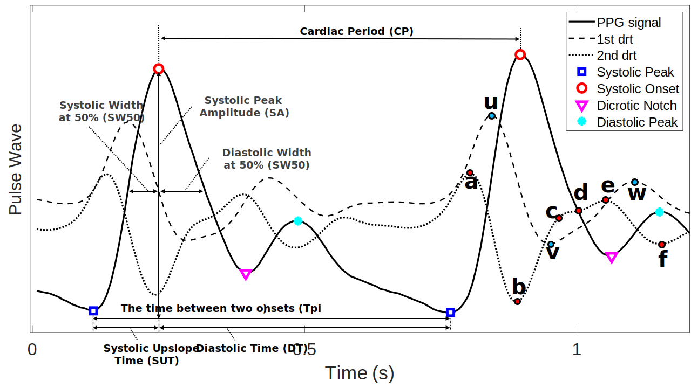

# PhysioZoo PPG Software documentation

Photoplethysmogram beat detection and biomarkers to assess cardiac conduction.

## Introduction

PhysioZoo PPG Software is a collaborative platform dedicated to the study of Photoplethysmogram (PPG) signals with morphological features into a Python toolbox, denoted pyPPG. The PPG peak and onset detection are implemented with clinically relevant biomarkers for the analysis of continuous PPG time series. 

## Description
The pyPPG is a python toolbox, which detects beats in a photoplethysmogram (PPG) signal using the improved 'Automatic Beat Detection' beat detector. The following steps are required to extract the PPG peaks and morphological PPG biomarkers, which steps are impelemented in the pyPPG toolbox:

1. PPG Signal Preprocessing - Before computing the PPG morphological biomarkers, prefiltering of the raw PPG time series is performed to remove the baseline wander as well as remove high-frequency noise.  The following filters have been implemented as default in the pyPPG toolbox:
	- 4th order Chebyshev Type II 0.5-12 Hz band-pass filtering for original signal: The 12 Hz low-pass filtering has two main reason. The first one was to avoid the time-shifting of a given fiducial point, particularly the systolic onset, and dicrotic notch. The second reason was to eliminate the unwanted frequency contents from the 1st and 2nd derivatives. The 0.5 Hz high-pass filtering was used to minimize the baseline wondering of the PPG signal.
    - 20 ms moving average filtering (MAF) for band-pass filtered signal: In the case of very noisy signals, some high-frequency content can remain in the band-pass filter signal. For this purpose, a 20 ms MAF with 22.5 Hz cut-off frequency has been applied after the band-pass filtering.
    - 10 ms MAF for the 1st and 2nd derivatives: To eliminate the high-frequency content in the 1st and 2nd derivatives, a 10 ms MAF with 45 Hz cut-off frequency has been applied.

2. PPG Fiducial Points Detection - The toolbox extracts the the following fiducial points:
    - original signal: Pulse onset, Pulse peak, Dicrotic notch
    - 1st derivative: u, v, w
    - 2nd derivative: a, b, c, d, e, f

3. Engineering of PPG Biomarkers - Using the fiducial points PPG biomarkers are engineered for individual PPG cycles. When a biomarker cannot be engineered because some fiducial points could not be detected by wavedet then the feature was marked as a NaN. For an PPG channel a total of 62 features are extracted from intervals duration and 9 from waves characteristics to describe the ECG morphology.

4. Summary Statistics - For a specified time window the 10 summary statistics (duration, mean, median, STD, Percentile25, Percentile75, IQR, Skewness, Kurtosis, MAD) are computed for all PPG biomarkers.

## Installation
(Available on pip, with the command: 
pip install pyppg)

## Requirements

### Python Requirements:

Python >= 3.10
scipy == 1.9.1
numpy == 1.23.2
dotmap == 1.3.30
pandas == 1.5.0
wfdb == 4.0.0
mne == 1.2.0

All the python requirements are installed when the toolbox is installed, no need for additional commands.

### System Requirements:

To run the wavdet fiucial-points detector matlab runtime (MCR) 2021a is requierd.
https://www.mathworks.com/products/compiler/matlab-runtime.html

## Documentation

The main components of the platform are:
1. **Software**:
    - An open-source algorithmic pyPPG toolbox (pyPPG), which implements the PPG peak and onsets detection algorithms and prefiltering routines. This can be used within your own data analysis code using the pyPPG API.
    - An open-source graphical user interface (PZ-UI) that provides a user-friendly interface for advanced PPG analysis of Systolic peak-to-peak intervals time series and data visualization tools. This enables easy access to PPG analysis without writing any code.
2. **Databases**
    - The PPG signals are based on the PhysioNet Databases. Available [here](https://physionet.org/about/database/) .
3. **Configuration**
    - A set of configuration files that adapt the PPG peak detection and pyPPG algorithms to work with sleep PPG data.

All PPG measures can be further adapted for the analysis for efficient heart rate measurement as well as health assessment with clinically relevant biomarkers.