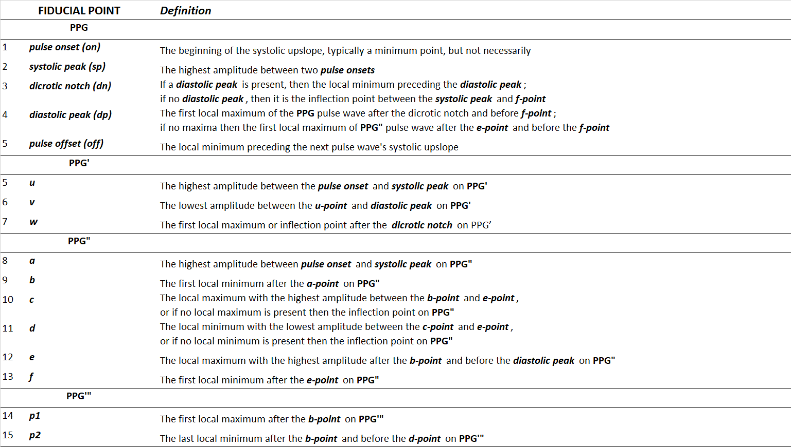

# *pyPPG* toolbox documentation

Photoplethysmogram (PPG) beat detection, fiducial points detection, and comprhessive assessment of standard biomarkers.

## Introduction
The ***pyPPG*** is a standardised toolbox to analyze long-term finger PPG recordings in real-time. The state-of-the-art PPG biomarkers have been identified, implemented in the *pyPPG* toolbox, and validated on standard, public available PPG databases.
The *pyPPG* using the improved *Automatic Beat Detector* [(*Aboy et al. 2005*)](https://ieeexplore.ieee.org/abstract/document/1510850).  The PPG peak and onset detection are implemented with. The *pyPPG* offers a robust beat detection, and a comprhessive assessment of clinically relevant biomarkers of continuous PPG time series.

## Description
The following steps are implemented in the ***pyPPG*** toolbox:

1. **Prefiltering** 
   - Before computing the PPG morphological biomarkers, prefiltering of the raw PPG time series is performed to remove the baseline wander as well as remove high-frequency noise.  The following filters have been implemented as default in the pyPPG toolbox:
     - ***4th order Chebyshev Type II 0.5-12 Hz band-pass filtering for original signal***: The 12 Hz low-pass filtering has two main reason. The first one was to avoid the time-shifting of a given fiducial point, particularly the systolic onset, and dicrotic notch. The second reason was to eliminate the unwanted frequency contents from the PPG derivatives. The 0.5 Hz high-pass filtering was used to minimize the baseline wondering of the PPG signal.
     - ***20 ms moving average filtering (MAF) for band-pass filtered signal***: In the case of very noisy signals, some high-frequency content can remain in the band-pass filter signal. For this purpose, a 20 ms MAF with 22.5 Hz cut-off frequency has been applied after the band-pass filtering.
     - ***10 ms MAF for the PPG derivatives***: To eliminate the high-frequency content in the PPG derivatives, a 10 ms MAF with 45 Hz cut-off frequency has been applied.

2. **Pulse wave segmentation**
   - ***Systolic peak detection***
   - ***Pulse onset detection***
3. **Fiducial Points Detection**
    - ***PPG***: *on, sp, dn, dp, off*
    - ***PPG'***: *u, v, w*
    - ***PPG"***: *a, b, c, d, e, f*
    - ***PPG'"***: *p1*, *p2*
   

4. **Engineering of Biomarkers** 
   - Using the fiducial points PPG biomarkers are engineered for individual PPG cycles. When a biomarker cannot be engineered because some fiducial points could not be detected by wavedet then the feature was marked as a NaN. For an PPG channel a total of 74 features are extracted from intervals duration and 9 from waves characteristics to describe the ECG morphology.

5. **General Statistics of biomarkers**
   - **Duration**: The length of the PPG signal. **Average** (AVG): Sum of all data divided by the number of entries. **Median** (MED): Value in the middle of the ordered set of data. **Standard deviation** (STD): Measure variability and consistency of the sample. **Quartiles** (Q1, Q3): The data value at which percent of the value in the data set is less than or equal to this value, calculated with 25th or 75th. **IQR**: Inter Quartile Range, the measure of the middle 50\% of data. **Skewness** (SKW): The measure of the lack of symmetry from the mean of the database. **Kurtosis** (KUR): The pointedness of a peak in the distribution curve. **MAD**: Average distance between the mean and each data value. 

6. **+PPG Signal quality assessment**
## Installation
(Available on pip, with the command: 
***pip install pyppg***)

## Requirements

### Python Requirements:

Python >= 3.10
scipy == 1.9.1
numpy == 1.23.2
dotmap == 1.3.30
pandas == 1.5.0
wfdb == 4.0.0
mne == 1.2.0

All the python requirements are installed when the toolbox is installed, no need for additional commands.

### System Requirements:

To run the wavdet fiucial-points detector matlab runtime (MCR) 2021a is requierd.
https://www.mathworks.com/products/compiler/matlab-runtime.html

## The main components:
1. **Software**
    - An open-source algorithmic ***pyPPG*** toolbox, which implements the PPG peak and onsets detection algorithms and prefiltering routines. This can be used within your own data analysis code using the ***pyPPG*** API.
2. **Databases**
    - The PPG signals are based on the ***PhysioNet Databases***. Available [here](https://physionet.org/about/database/) .
3. **Configuration**
    - A set of configuration files that adapt the PPG peak detection and ***pyPPG*** algorithms to work with sleep PPG data.

All PPG measures can be further adapted for the analysis for efficient heart rate measurement as well as health assessment with clinically relevant biomarkers.
