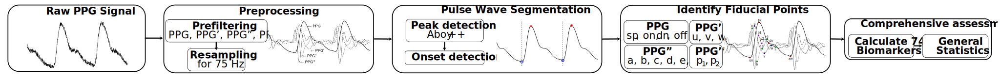
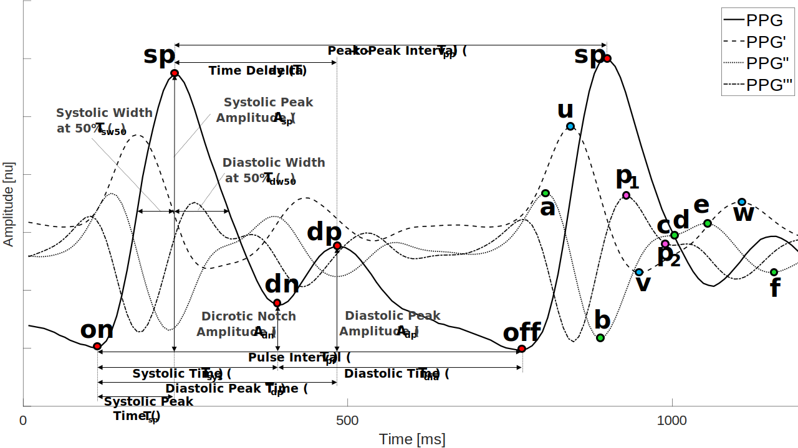

*pyPPG* toolbox documentation
=============================

Photoplethysmogram (PPG) beat detection, fiducial points detection, and
comprhessive assessment of standard biomarkers.

Introduction
------------

The **pyPPG** is a standardised toolbox to analyze long-term finger PPG recordings in real-time. The state-of-the-art PPG biomarkers have been identified, implemented in the *pyPPG* toolbox, and validated on standard, public available PPG databases. The *pyPPG* using the improved *Automatic Beat Detector* `(Aboy et al. 2005) <https://ieeexplore.ieee.org/abstract/document/1510850>`__. The PPG peak and onset detection are implemented with. The *pyPPG* offers a robust beat detection, and a comprhessive assessment of clinically relevant biomarkers of continuous PPG time series.

Description
-----------

The following steps are implemented in the **pyPPG** toolbox:

1. **Loading a raw PPG signal**: The toolbox can accept various file formats such as *.mat*, *.csv*, *.txt*, or *.edf*. These files should contain raw PPG data along with the corresponding sampling rate.

2. **Preprocessing**: The raw signal is filtered to remove unwanted noise and artifacts. Subsequently, the signal is resampled to a uniform rate of 75 Hz.

3. **Pulse wave segmentation**: The toolbox employs a peak detector to identify the systolic peaks. Based on the peak locations, the toolbox also detects the pulse onsets and offsets, which indicate the start and end of the PPG pulse waves.

4. **Fiducial points identification**: For each pulse wave, the toolbox detects a set of fiducial points.

5. **Biomarker engineering**: Based on the fiducial points, a set of 74 PPG digital biomarkers are engineered.

The *pyPPG* toolbox also provides an optional PPG signal quality index based on the Matlab implementation of the work by `(Li et al. 2015) <https://github.com/MIT-LCP/PhysioNetChallengePublic/blob/master/2015/sample-submission/ppgSQI.m>`__.

The toolbox identifies individual pulse waves in a PPG signal by identifying **systolic peaks (sp)**, and then identifying the **pulse onset (on)** and **offset (off)** on either side of each systolic peak which indicate the start and end of the pulse wave, respectively.

Installation
------------

(Available on pip, with the command: **pip install pyppg**)

Requirements
------------

Python Requirements:
~~~~~~~~~~~~~~~~~~~~

Python >= 3.10

scipy == 1.9.1

numpy == 1.23.2

dotmap == 1.3.30

pandas == 1.5.0

wfdb == 4.0.0

mne == 1.2.0

All the python requirements are installed when the toolbox is installed, no need for additional commands.

Documentation:
--------------

https://pyppg.readthedocs.io/en/latest/

The main components:
--------------------

1. **Software**

   -  An open-source algorithmic **pyPPG** toolbox, which implements the PPG peak and onsets detection algorithms and prefiltering routines. This can be used within your own data analysis code using the **pyPPG** API.

2. **Databases**

   -  The PPG signals are based on the **PhysioNet Databases**. Available `here <https://physionet.org/about/database/>`__ .

3. **Configuration**

   -  A set of configuration files that adapt the PPG peak detection and **pyPPG** algorithms to work with sleep PPG data.

All PPG measures can be further adapted for the analysis for efficient heart rate measurement as well as health assessment with clinically relevant biomarkers.

