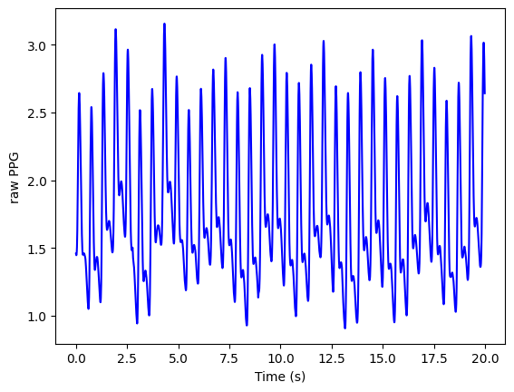
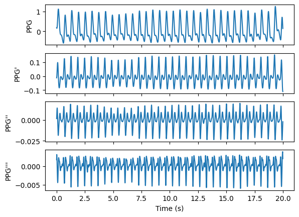

Comprehensive PPG Analysis
==========================

.. raw:: html

   

In this tutorial we will learn how to extract biomarkers from a photoplethysmogram (PPG) signal.

Our objectives are to:

    * Detect the standard fiducial points on PPG pulse waves
    * Calculate pulse wave biomarkers from the fiducial points
    * Saving data in different data format

You can use the sample PPG data by downloading it from the following link: `Sample PPG data <https://zenodo.org/record/8369487/files/Sample_PPG_MAT_125Hz.mat?download=1>`__.

Setup
______
Import Python packages:
-----------------------

* Install the pyPPG toolbox for PPG analysis

.. code-block:: python

    pip install pyPPG==1.0.41

* Import required components from pyPPG

.. code-block:: python

    from pyPPG import PPG, Fiducials, Biomarkers
    from pyPPG.datahandling import load_data, plot_fiducials, save_data
    import pyPPG.preproc as PP
    import pyPPG.fiducials as FP
    import pyPPG.biomarkers as BM
    import pyPPG.ppg_sqi as SQI

* Import other packages

.. code-block:: python

    import numpy as np
    import sys
    import json
    import pandas as pd

Setup input parameters:
-----------------------

The following input parameters are inputs to the `pyPPG.example <https://pyppg.readthedocs.io/en/latest/tutorials/pyPPG_example.html>`__ module (see the documentation for further details).

.. code-block:: python

    data_path = "Sample_PPG_MAT_125Hz.mat" # the path of the file containing the PPG signal to be analysed
    start_sig = 0 # the first sample of the signal to be analysed
    end_sig = -1 # the last sample of the signal to be analysed (here a value of '-1' indicates the last sample)
    savingfolder = 'temp_dir'
    savingformat = 'csv'

Loading a raw PPG signal:
-------------------------

.. code-block:: python

    # Load the raw PPG signal
    signal = load_data(data_path=data_path, start_sig=start_sig, end_sig=end_sig, use_tk=False)
    signal.v = signal.v [0:20*signal.fs] # 20 second long signal to be analysed

Plot the raw PPG signal:
------------------------

.. code-block:: python

    # import plotting package
    from matplotlib import pyplot as plt

    # setup figure
    fig, ax = plt.subplots()

    # create time vector
    t = np.arange(0, len(signal.v))/signal.fs

    # plot raw PPG signal
    ax.plot(t, signal.v, color = 'blue')
    ax.set(xlabel = 'Time (s)', ylabel = 'raw PPG')

    # show plot
    plt.show()

PPG signal processing
_______________________

Prepare the PPG data:
---------------------

Filter the PPG signal and obtain first, second and third derivatives (vpg, apg, and jpg respectively).

.. code-block:: python

    signal.filtering = True # whether or not to filter the PPG signal
    signal.fL=0.5000001 # Lower cutoff frequency (Hz)
    signal.fH=12 # Upper cutoff frequency (Hz)
    signal.order=4 # Filter order
    signal.sm_wins={'ppg':50,'vpg':10,'apg':10,'jpg':10} # smoothing windows in millisecond for the PPG, PPG', PPG", and PPG'"

    prep = PP.Preprocess(fL=signal.fL, fH=signal.fH, order=signal.order, sm_wins=signal.sm_wins)
    signal.ppg, signal.vpg, signal.apg, signal.jpg = prep.get_signals(s=signal)

Plot the derived signals

.. code-block:: python

    # setup figure
    fig, (ax1,ax2,ax3,ax4) = plt.subplots(4, 1, sharex = True, sharey = False)

    # create time vector
    t = np.arange(0, len(signal.ppg))/signal.fs

    # plot filtered PPG signal
    ax1.plot(t, signal.ppg)
    ax1.set(xlabel = '', ylabel = 'PPG')

    # plot first derivative
    ax2.plot(t, signal.vpg)
    ax2.set(xlabel = '', ylabel = 'PPG\'')

    # plot second derivative
    ax3.plot(t, signal.apg)
    ax3.set(xlabel = '', ylabel = 'PPG\'\'')

    # plot third derivative
    ax4.plot(t, signal.jpg)
    ax4.set(xlabel = 'Time (s)', ylabel = 'PPG\'\'\'')

    # show plot
    plt.show()

Store the derived signals in a class

.. code-block:: python

    # Initialise the correction for fiducial points
    corr_on = ['on', 'dn', 'dp', 'v', 'w', 'f']
    correction=pd.DataFrame()
    correction.loc[0, corr_on] = True
    signal.correction=correction

    # Create a PPG class
    s = PPG(signal)

Identify fiducial points:
--------------------------

Initialise the fiducials package

.. code-block:: python

    fpex = FP.FpCollection(s=s)

Extract fiducial points

.. code-block:: python

    fiducials = fpex.get_fiducials(s=s)

Display the results

.. code-block:: python

    print("Fiducial points:\n",fiducials + s.start_sig) # here the starting sample is added so that the results are relative to the start of the original signal (rather than the start of the analysed segment)

Plot fiducial points:
----------------------

.. code-block:: python

    # Create a fiducials class
    fp = Fiducials(fp=fiducials)

    # Plot fiducial points
    plot_fiducials(s, fp, savingfolder, legend_fontsize=12)

PPG fiducial points
     .. image:: PPG_MAT_sample.png
       :align: center

Calculate PPG SQI:
_________________________

.. code-block:: python

    # Get PPG SQI
    ppgSQI = round(np.mean(SQI.get_ppgSQI(ppg=s.ppg, fs=s.fs, annotation=fp.sp)) * 100, 2)
    print('Mean PPG SQI: ', ppgSQI, '%')

Calculate PPG biomarkers:
_________________________

.. code-block:: python

    # Init the biomarkers package
    bmex = BM.BmCollection(s=s, fp=fp)

    # Extract biomarkers
    bm_defs, bm_vals, bm_stats = bmex.get_biomarkers()
    tmp_keys=bm_stats.keys()
    print('Statistics of the biomarkers:')
    for i in tmp_keys: print(i,'\n',bm_stats[i])

    # Create a biomarkers class
    bm = Biomarkers(bm_defs=bm_defs, bm_vals=bm_vals, bm_stats=bm_stats)

Save PPG data:
______________

.. code-block:: python

    # Save PPG struct, fiducial points, biomarkers
    fp_new = Fiducials(fp.get_fp() + s.start_sig) # here the starting sample is added so that the results are relative to the start of the original signal (rather than the start of the analysed segment)
    save_data(s=s, fp=fp_new, bm=bm, savingformat=savingformat, savingfolder=savingfolder)

Extracted fiducial points
 .. image:: FID_vals.png
   :align: center

Extracted biomarkers
 .. image:: BM_vals.png
   :align: center

Biomarkers statistics
 .. image:: BM_stats.png
   :align: center

Biomarkers definitions
 .. image:: BM_defs.png
   :align: center